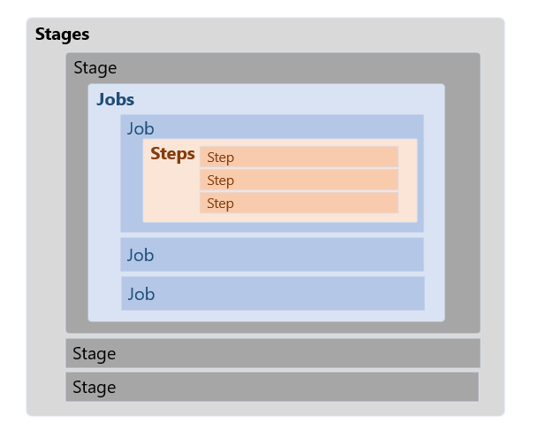

# 2. Azure Pipelines で最初に知っておきたいこと

今回のワークショップを実施する上で知っておきたいコンセプトを説明します。

## ⚡ クラシックな pipeline と YAML pipeline

ドキュメントや Azure DevOps の画面では、「クラシック (classic)」と表記されているものがあります。「クラシック (classic)」は文字通り旧来のパイプラインです。このワークショップは、新しい **YAML のパイプライン**を利用しますのでご注意ください。

## ⚡ はじめに知っておきたい知識

以下はシンプルな YAML パイプラインのサンプルです。この YAML を元に基本的なコンセプトを説明していきます。

```yaml
trigger:
  branches:
    include:
      - main

pool:
  vmImage: "ubuntu-latest"

variables:
  nodeVersion: "14.x"
  dotnetSdkVersion: "6.0.x"

stages:
  - stage: node_setup_stage
    displayName: Node setup
    jobs:
      - job: node_setup
        steps:
          - task: NodeTool@0
            displayName: Install Node.js v$(nodeVersion)
            inputs:
              versionSpec: $(nodeVersion)
          - script: echo 'Hello from Node v$(nodeVersion)'

  - stage: dotnet_setup_stage
    displayName: .NET setup
    dependsOn: node_setup_stage
    jobs:
      - job: dotnet_setup
        displayName: .NET setup
        steps:
          - task: UseDotNet@2
            displayName: Setup .NET SDK $(dotnetSdkVersion)
            inputs:
              version: $(dotnetSdkVersion)
          - script: echo 'Hello from .NET setup v$(dotnetSdkVersion)'
      - job: script_run
        displayName: Script run only
        steps:
          - script: |
              echo 'Hello from Script only'
              echo 'Hello from Script only 2'
```


### トリガー

定義したトリガーによってパイプラインが実行されます。トリガーの具体例は以下があります。

- コードがマージされたとき
- プルリクエストが作成されたとき
- 定期的なスケジュールによるトリガー

サンプルコードの先頭で `trigger` が定義されています。この定義だと、`main` ブランチに変更があった場合にパイプラインがトリガーされます。特定のフォルダー配下に変更があった場合のみといったフィルターを定義することも可能です。

```yml
trigger:
  branches:
    include:
      - main
```


> 🔖 参考:[パイプラインをトリガーするイベントを指定する](https://docs.microsoft.com/ja-jp/azure/devops/pipelines/build/triggers?view=azure-devops)


### Azure Pipelines エージェント

パイプラインの実行されているインフラストラクチャーが **エージェント** です。エージェントには多くに2種類あります。

1つめは **Microsoft-hosted agents** です。このエージェントの仮想マシンの管理は全て Microsoft が行ってくれるため、運用の手間がかかりません。

利用できる OS は Windows / Linux / MacOS で様々なバージョンを利用可能です。Microsoft-hosted agents に関する詳細は以下ドキュメントに記載されています。

- [Microsoft によってホストされるエージェント | Microsoft Docs](https://docs.microsoft.com/ja-jp/azure/devops/pipelines/agents/hosted?view=azure-devops&tabs=yaml)


2つめは、**Self-hosted agents** です。名称の通り、自分でホストして使う仮想マシンになります。

- [Self-hosted agents - Azure Pipelines agents | Microsoft Docs](https://docs.microsoft.com/ja-jp/azure/devops/pipelines/agents/agents?view=azure-devops&tabs=browser#install)

運用コスト面から まずは Microsoft-hosted agents を利用することをおすすめします。そこで不足がある場合は Self-hosted agents の利用を検討することが一般的です。

今回のサンプルでは、`stages` の前に `pool` に `vmImage` を定義していることで、このパイプラインレベル（パイプライン全体）の `pool` を指定しています。

```yml
pool:
  vmImage: "ubuntu-latest"
```

`stage` や `job` のレベルで指定することも可能です。

> 🔖 参考: [プール - YAML スキーマ リファレンス | Microsoft Docs](https://docs.microsoft.com/ja-jp/azure/devops/pipelines/yaml-schema?view=azure-devops&tabs=schema%2Cparameter-schema#pool)


### variables (変数)

YAML ファイルの中でパイプラインで利用する変数を定義することがでできます。変数のユースケースの一例として、ビルドやデプロイの処理は同じですがビルドや対象のプロジェクトやデプロイ先のみが異なる場合は変数を変えるだけで汎用的にパイプラインを作ることができます。

```yml
variables:
  nodeVersion: "14.x"
  dotnetSdkVersion: "6.0.x"
```

> 🔖 [変数の定義 | Microsoft Docs](https://docs.microsoft.com/ja-jp/azure/devops/pipelines/process/variables?view=azure-devops&tabs=yaml%2Cbatch)


今回のサンプルにあるコードは単純な変数定義ですが、[変数グループ](https://docs.microsoft.com/ja-jp/azure/devops/pipelines/library/variable-groups?view=azure-devops&tabs=yaml)を使って複数のパイプラインで変数を共通化するなど様々な利用方法があります。

### stages, jobs, steps


パイプラインの処理は、`stages`、`jobs`、`steps` で構成できます。



これらをひとつずつ見ていきましょう。

#### steps

`steps` の中で step を定義します。step は、[script (スクリプト)](https://docs.microsoft.com/ja-jp/azure/devops/pipelines/get-started/key-pipelines-concepts?view=azure-devops#script) と [task (タスク)](https://docs.microsoft.com/ja-jp/azure/devops/pipelines/get-started/key-pipelines-concepts?view=azure-devops#task) です。`steps` で定義した順番に実行が可能です。

script (スクリプト) は、PowerShell や Bash で実行するコマンドを定義し、実行する step です。

task (タスク) は、特定の目的に合わせて作られた script のパッケージです。たとえば、ファイルを zip にするといった汎用的なタスクから、Azure Functions へデプロイするためのタスクなど多数用意されています。

#### jobs

`jobs` には、1つ以上の `job` が含まれています。各 `job` は `steps` で構成されます。`jobs` の中の各 `job` は並列で動作します。今回のワークショップでは詳しく触れませんが、`job` 間に`dependsOn` を定義しすることで依存関係を持たせることが可能です。

> 🔖 参考: [パイプラインにジョブを指定する | Microsoft Docs](https://docs.microsoft.com/ja-jp/azure/devops/pipelines/process/phases?view=azure-devops&tabs=yaml)


#### stages

`stages` には1つ以上の `stage` を定義します。各 `stage` は `jobs` で構成されます。`stages` の中の各 `stage` は並列で動作します。`job` 同様に依存関係を持たせることが可能です。サンプルの YAML では、`dotnet_setup_stage` は、`node_setup_stage` が成功したときのみ実行するようになっています。`dependsOn` で定義すると、デフォルトでは指定した `stage` が成功したときに実行されます。別の条件を付けたいときは、`condition` を定義することでより詳細な依存関係を構成することができます。

```yml
  - stage: dotnet_setup_stage
    displayName: .NET setup
    dependsOn: node_setup_stage
```

> 🔖 参考: [ステージ、依存関係、条件を追加する | Microsoft Docs](https://docs.microsoft.com/ja-jp/azure/devops/pipelines/process/stages?view=azure-devops&tabs=yaml)


## 🎉 Congraturations

お疲れ様でした。ここでは、YAML パイプラインの全体構成と、主要なシンタックスについて学びました。ここで紹介した以上にたくさんの機能がありますが、今回は第一歩を踏み出すための基本的な内容にとどめています。やりたいことに合わせてドキュメントをご確認いただき、より便利なパイプラインの構築をしましょう。


## 参考

- [新しい Azure Pipelines ユーザー向けの主要な概念 | Microsoft Docs](https://docs.microsoft.com/ja-jp/azure/devops/pipelines/get-started/key-pipelines-concepts?view=azure-devops)
- [Azure Pipelines エージェント | Microsoft Docs](https://docs.microsoft.com/ja-jp/azure/devops/pipelines/agents/agents?view=azure-devops&tabs=browser)
- [AML スキーマ リファレンス | Microsoft Docs](https://docs.microsoft.com/ja-jp/azure/devops/pipelines/yaml-schema?view=azure-devops&tabs=schema%2Cparameter-schema)
- [変数の定義 | Microsoft Docs](https://docs.microsoft.com/ja-jp/azure/devops/pipelines/process/variables?view=azure-devops&tabs=yaml%2Cbatch)


<br>

[戻る](./1_why-devops.md) | [次へ: 3. はじめてのパイプライン作成](./3_create-pipeline.md)

---

[README へ戻る](../README.md)